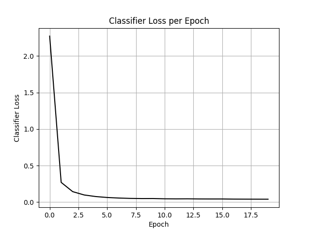

# SURF-Indoor-Localization

## Overall:
2017 SURF: Indoor Localization </br>
Mainly relevant essential material, files and code. </br>
Hope this summer can be cool. </br>
The main idea is from [Low-effort place recognition with WiFi fingerprints using deep learning](https://arxiv.org/abs/1611.02049) and the implementation based on this [repo](https://github.com/aqibsaeed/Place-Recognition-using-Autoencoders-and-NN) with slight modifications.


## Folders:
- algorithm: holding relevant code for offline
- android: holding code of app for online
- Papers: relevant papers for research

## Problems:
1. In deep learning algorithm, the testing accuracy is much lower than training and validation.
- ~~an strong relation between loss of AutoEncoder and final testing accuracy was observed. May be we should design a better AutoEncoder if necessary~~


Solving: This problem mainly blames to the preprocessing of the data. In the data base, the non-detected APs are represented as 100 but it is much better to use -110. In addition, when scaling the original data, it is better to jointly scaling them rather than independently. 

## Visualized model result:

The lastest version of model has follwing settings:
- Resetting the ratio of training and validation 0.9
- Dropout with 0.5
- Use tanh in autoencoder while relu in classifier

Here are some plots of evaluation critera




Theoretically, this model can provide a 91~93% accuracy. Whether this model works or not in practical condition needs proof. 
Now we need to establish our own database which might have more than 100 APs that much more smaller than 520 in [UJIndoorLoc](https://archive.ics.uci.edu/ml/datasets/ujiindoorloc) database. Thus, the internal structure may need modifications such as the number of units in hidden layer and the number of layers in autoencoder which is better to be smaller as the dimension of raw RSS data inputs is much more smaller.

## APs in EE 4th floor

There are 143 APs are detected but, as some rooms are not accessible, the total number might be more than that. We are trying to use this as the input dimension and -110 representing lack of signal for an AP. 
```python
143
00:26:5a:b2:c1:ea 	 40
0a:18:d6:95:93:1e 	 65
0e:18:d6:95:93:1e 	 100
12:18:d6:95:93:1e 	 137
28:2c:b2:fd:07:b9 	 13
38:46:08:c9:87:0c 	 19
4c:e6:76:64:df:00 	 83
52:a5:89:79:19:ab 	 34
6e:72:e7:3f:05:1e 	 38
78:eb:14:e7:2a:82 	 56
80:89:17:e8:e7:f8 	 76
88:25:93:61:65:78 	 117
8c:f2:28:27:62:84 	 141
90:72:40:16:ca:00 	 31
9c:50:ee:30:30:80 	 93
9c:50:ee:30:31:20 	 85
9c:50:ee:30:31:21 	 23
9c:50:ee:30:37:a0 	 9
9c:50:ee:30:37:a1 	 107
9c:50:ee:30:39:e0 	 57
9c:50:ee:30:39:e1 	 89
9c:50:ee:30:3f:c0 	 58
9c:50:ee:30:3f:c1 	 138
9c:50:ee:30:44:00 	 125
9c:50:ee:30:44:01 	 59
9c:50:ee:30:45:20 	 72
9c:50:ee:30:45:21 	 17
9c:50:ee:30:45:c0 	 52
9c:50:ee:30:45:c1 	 142
9c:50:ee:30:46:20 	 101
9c:50:ee:30:46:21 	 128
9c:50:ee:3f:71:80 	 18
9c:50:ee:3f:71:81 	 62
9c:50:ee:3f:71:e0 	 10
9c:50:ee:3f:71:e1 	 130
9c:50:ee:3f:73:00 	 14
9c:50:ee:3f:73:01 	 49
9c:50:ee:3f:73:20 	 129
9c:50:ee:3f:73:21 	 92
9c:50:ee:3f:75:c0 	 118
9c:50:ee:3f:79:60 	 80
9c:50:ee:3f:79:61 	 2
9c:50:ee:3f:7e:60 	 61
9c:50:ee:3f:7e:61 	 8
9c:50:ee:3f:7e:e0 	 122
9c:50:ee:3f:84:a0 	 140
9c:50:ee:3f:8a:20 	 29
9c:50:ee:3f:8a:21 	 47
9c:50:ee:3f:8b:20 	 37
9c:50:ee:3f:8b:21 	 79
9c:50:ee:3f:8b:a0 	 121
9c:50:ee:3f:8b:a1 	 94
9c:50:ee:3f:8d:21 	 139
9c:50:ee:3f:8f:e0 	 39
9c:50:ee:3f:8f:e1 	 91
9c:50:ee:3f:90:20 	 106
9c:50:ee:3f:90:21 	 115
9c:50:ee:3f:90:60 	 123
9c:50:ee:3f:90:61 	 26
9c:50:ee:3f:90:80 	 95
9c:50:ee:3f:90:81 	 96
9c:50:ee:3f:90:a0 	 70
9c:50:ee:3f:90:a1 	 124
9c:50:ee:3f:91:20 	 99
9c:50:ee:3f:91:21 	 74
9c:50:ee:3f:91:60 	 54
9c:50:ee:3f:91:61 	 45
9c:50:ee:3f:91:c0 	 42
9c:50:ee:3f:91:c1 	 16
9c:50:ee:3f:91:e0 	 35
9c:50:ee:3f:91:e1 	 15
9c:50:ee:3f:92:40 	 1
9c:50:ee:3f:92:41 	 103
9c:50:ee:3f:92:80 	 53
9c:50:ee:3f:92:81 	 3
9c:50:ee:3f:92:a0 	 77
9c:50:ee:3f:92:a1 	 32
9c:50:ee:3f:93:a0 	 110
9c:50:ee:3f:93:a1 	 133
9c:50:ee:3f:95:a0 	 71
9c:50:ee:3f:95:a1 	 11
9c:50:ee:3f:98:c0 	 132
9c:50:ee:3f:98:c1 	 68
9c:50:ee:3f:99:00 	 44
9c:50:ee:3f:99:01 	 102
9c:50:ee:3f:99:c0 	 127
9c:50:ee:3f:99:c1 	 109
9c:50:ee:3f:9c:60 	 78
9c:50:ee:3f:9c:61 	 120
9c:50:ee:3f:9c:a0 	 88
9c:50:ee:3f:9c:a1 	 131
9c:50:ee:3f:9d:a1 	 87
9c:50:ee:3f:9e:60 	 27
9c:50:ee:3f:9e:61 	 84
9c:50:ee:3f:9e:a0 	 46
9c:50:ee:3f:9e:a1 	 81
9c:50:ee:3f:9e:e0 	 66
9c:50:ee:3f:9e:e1 	 113
9c:50:ee:3f:9f:20 	 135
9c:50:ee:3f:a0:c1 	 126
9c:50:ee:3f:a1:e0 	 48
9c:50:ee:3f:a2:e0 	 112
9c:50:ee:3f:a2:e1 	 60
a4:56:02:f0:35:c1 	 86
a4:56:02:f0:35:c3 	 50
a8:15:4d:f5:f1:26 	 55
a8:58:40:59:ac:80 	 28
ac:4e:91:49:fb:a0 	 105
ac:4e:91:49:fb:a1 	 6
ac:4e:91:49:fc:c0 	 82
ac:4e:91:49:fc:c1 	 51
ac:4e:91:49:fd:40 	 104
ac:4e:91:61:1f:c0 	 114
ac:4e:91:61:1f:c1 	 4
ac:4e:91:61:1f:e0 	 41
ac:4e:91:61:1f:e1 	 73
ac:4e:91:61:20:80 	 33
ac:4e:91:61:20:81 	 136
ac:4e:91:61:20:a0 	 97
ac:4e:91:61:20:a1 	 98
ac:4e:91:61:21:60 	 67
ac:4e:91:61:21:61 	 7
ac:4e:91:61:21:80 	 75
ac:4e:91:61:21:81 	 119
ac:4e:91:61:21:a0 	 30
ac:4e:91:61:21:a1 	 22
b0:75:d5:5f:c5:37 	 12
b0:75:d5:5f:d3:b1 	 134
b0:75:d5:5f:d4:38 	 64
b0:75:d5:5f:d4:3b 	 90
b0:75:d5:5f:d4:57 	 5
b0:75:d5:80:5c:8c 	 69
b0:75:d5:80:84:cd 	 63
b0:d5:9d:56:99:7a 	 43
bc:46:99:61:5b:78 	 36
c2:75:d5:80:84:cd 	 116
cc:34:29:6d:f3:56 	 20
d2:75:d5:80:84:cd 	 111
d4:b1:10:ac:62:40 	 21
d4:b1:10:ac:62:61 	 0
dc:fe:18:58:fd:3a 	 25
e2:75:d5:80:84:cd 	 24
ec:17:2f:4a:cf:fc 	 108
```
