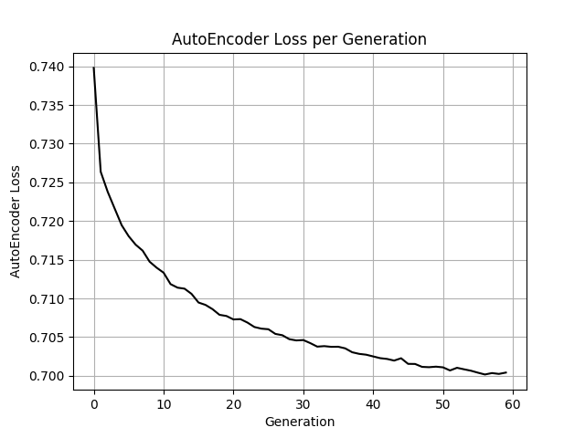

# SURF-Indoor-Localization

## Overall:
2017 SURF: Indoor Localization  
Mainly relevant essential material, files and code.  
Hope this summer can be cool.  

## Folders:
- algorithm: holding relevant code for offline
- android: holding code of app for online
- Papers: relevant papers for research

## Problems:
1. In deep learning algorithm, the testing accuracy is much lower than training and validation.
- an strong relation between loss of AutoEncoder and final testing accuracy was observed. May be we should design a better AutoEncoder if necessary. 

Solving: This problem mainly blames to the preprocessing of the data. In the data base, the non-detected APs are represented as 100 but it is much better to use -110. In addition, when scaling the original data, it is better to jointly scaling them rather than independently. 

## Visualized model result:

The lastest version of model has follwing settings:
- Resetting the ratio of training and validation 0.9
- Dropout with 0.5
- Use tanh in autoencoder while relu in classifier

Here are some plots of evaluation critera

