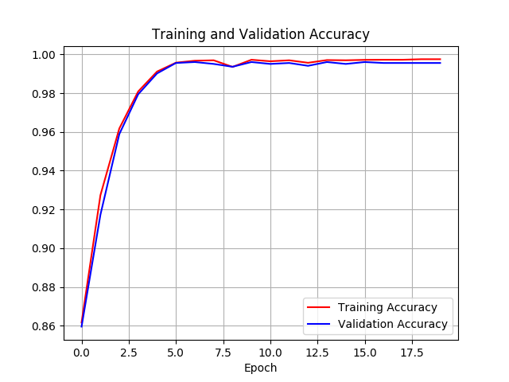

# SURF-Indoor-Localization

## Overall:
2017 SURF: Indoor Localization  
Mainly relevant essential material, files and code.  
Hope this summer can be cool.  
The main idea is from [Low-effort place recognition with WiFi fingerprints using deep learning](https://arxiv.org/abs/1611.02049) and the implementation based on this [repo](https://github.com/aqibsaeed/Place-Recognition-using-Autoencoders-and-NN) with slight modifications.

## Folders:
- algorithm: holding relevant code for offline
- android: holding code of app for online
- Papers: relevant papers for research

## Problems:
1. In deep learning algorithm, the testing accuracy is much lower than training and validation.
- ~~an strong relation between loss of AutoEncoder and final testing accuracy was observed. May be we should design a better AutoEncoder if necessary~~

Solving: This problem mainly blames to the preprocessing of the data. In the data base, the non-detected APs are represented as 100 but it is much better to use -110. In addition, when scaling the original data, it is better to jointly scaling them rather than independently. 

## Visualized model result:

The lastest version of model has follwing settings:
- Resetting the ratio of training and validation 0.9
- Dropout with 0.5
- Use tanh in autoencoder while relu in classifier

Here are some plots of evaluation critera

Theoretically, this model can provide a 91~93% accuracy. Whether this model works or not in practical condition needs proof. 
Now we need to establish our own database which might have more than 100 APs that much more smaller than 520 in [UJIndoorLoc](https://archive.ics.uci.edu/ml/datasets/ujiindoorloc) database. Thus, the internal structure may need modifications such as the number of units in hidden layer and the number of layers in autoencoder which is better to be smaller as the dimension of raw RSS data inputs is much more smaller.
